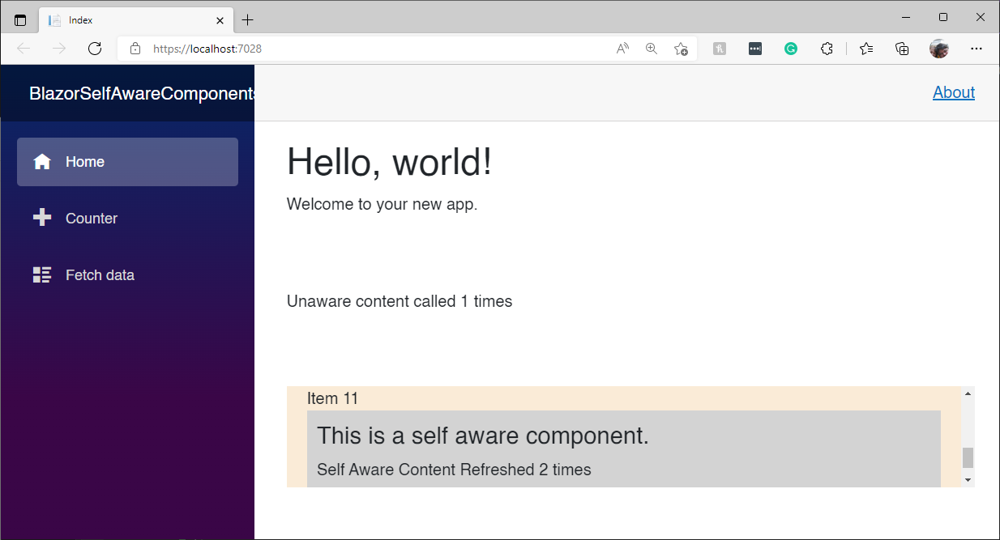

# Self Aware Blazor Components

This repo demonstrates how to use the awesome [BlazorIntersectionObserver](https://github.com/ljbc1994/BlazorIntersectionObserver) project to create components that only render when they come into view.

BlazorIntersectionObserver uses the [Intersection Observer API](https://developer.mozilla.org/en-US/docs/Web/API/Intersection_Observer_API) which is available in modern browsers. The idea is that it has traditionally been very difficult to determine when an html element becomes visible relative to either a parent element or the main viewport.

The [BlazorIntersectionObserver README](https://github.com/ljbc1994/BlazorIntersectionObserver#readme) is pretty good at explaining things, but in my opinion, the demos don't drive home the concept or illustrate the behavior.

This document is also serving as the script for [BlazorTrain](https://blazortrain.com/) episode 73: Self-Aware Components. You can follow the steps here to gain a bit more understanding of BlazorIntersectionObserver.

## Making the case for self-awareness

Before we even get into Blazor components, let's get started with a quick demo that shows the default behavior of how and when html elements are rendered.

Create a new Blazor Server application in Visual Studio. It doesn't matter what you call it.

Open the *Pages\\_Hosts.cshtml* file and change the `render-mode` from `ServerPrerendered` to `Server`

```html
@page "/"
@namespace BlazorSelfAwareComponents.Pages
@addTagHelper *, Microsoft.AspNetCore.Mvc.TagHelpers
@{
    Layout = "_Layout";
}

<component type="typeof(App)" render-mode="Server" />
```


To demonstrate default behavior, change *Pages\Index.razor* to the following:

```c#
@page "/"

<PageTitle>Index</PageTitle>

<h1>Hello, world!</h1>

Welcome to your new app.
<br/>
<br/>
<br/>
<br/>
<br/>
<br/>

<div>
    @UnawareDivContent
</div>

<br/>
<br/>
<br/>

@code{

    int unAwareCount = 0;
    private string UnawareDivContent
    {
        get
        {
            unAwareCount++;
            return $"Unaware content called {unAwareCount} times";
        }
    }
}
```

Run the app. Resize the browser from the lower-right corner until the `<div>` is hidden, and then expand the browser to reveal it again. You should see no change:


There are situations in which you want to refresh the content of an element (like a `<div>`) only when it comes into view.

As an experiment, put a breakpoint on line 30 and run it again:


Note that it gets called only once. But, does it get called BEFORE or AFTER it comes into view. Let's modify the markup so the `<div>` is out of view and try again:

```c#
@page "/"

<PageTitle>Index</PageTitle>

<h1>Hello, world!</h1>

Welcome to your new app.
<br/>
<br/>
<br/>
<br/>
<br/>
<br/>
<br/>
<br/>
<br/>
<br/>
<br/>
<br/>
<br/>
<br/>
<br/>
<br/>
<br/>
<br/>
<br/>
<br/>
<br/>
<br/>
<br/>
<br/>
<br/>
<br/>
<br/>
<br/>
<br/>
<br/>
<br/>
<br/>
<br/>
<br/>
<br/>
<br/>

<div>
    @UnawareDivContent
</div>

<br/>
<br/>
<br/>

@code{

    int unAwareCount = 0;
    private string UnawareDivContent
    {
        get
        {
            unAwareCount++;
            return $"Unaware content called {unAwareCount} times";
        }
    }
}
```

Set a breakpoint on line 60 and try again:


You'll notice that the `UnawareDivContent` property is read right away before the first render. We want to be able to call `UnawareDiveContent` every time the `<div>` comes into view. That's the goal.

#### Why?

The Intersection Observer API documentation outlines perfectly the situations in which you'd want to have more control over when elements get rendered:

- Lazy-loading of images or other content as a page is scrolled.
- Implementing "infinite scrolling" web sites, where more and more content is loaded and rendered as you scroll, so that the user doesn't have to flip through pages.
- Reporting of visibility of advertisements in order to calculate ad revenues.
- Deciding whether or not to perform tasks or animation processes based on whether or not the user will see the result.

## Using the Observer Service

Add the [Nuget Package](https://www.nuget.org/packages/BlazorIntersectionObserver) to your project. 

This is what I've added to my *.csproj* file at the time of this writing:

```xml
	<ItemGroup>
		<PackageReference Include="BlazorIntersectionObserver" Version="3.1.0" />
	</ItemGroup>
```

Now, add the following to the very top of *Program.cs* :

```c#
global using Ljbc1994.Blazor.IntersectionObserver;
```

Add the service to `builder.Services`

```c#
builder.Services.AddIntersectionObserver();
```

Add these using statements to *_Imports.razor*:

```c#
@using Ljbc1994.Blazor.IntersectionObserver.Components
@using Ljbc1994.Blazor.IntersectionObserver.API
```

Finally, replace *Index.razor* with the following:

```c#
@page "/"
@inject IIntersectionObserverService ObserverService

<PageTitle>Index</PageTitle>

<h1>Hello, world!</h1>

@if (ImageEntry != null)
{
    @if (ImageEntry.IsIntersecting)
    {
        <span>Image is visible </span>
    }
    else
    {
        <span>Image is NOT visible </span>
    }
}

<br />
<br />
<br />
<br />
<br />


<br />
<br />
More stuff

@code {

    public ElementReference ImageElement { get; set; }

    public IntersectionObserverEntry ImageEntry;

    protected override async Task OnAfterRenderAsync(bool firstRender)
    {
        if (firstRender)
        {
            await SetupObserver();
        }
    }

    public async Task SetupObserver()
    {
        await ObserverService.Observe(ImageElement, (entries) =>
        {
            ImageEntry = entries.FirstOrDefault();
            StateHasChanged();
        });
    }
}
```

#### What's going on here?

The purpose of this demo is to show how the `ObserverService` works in general. Don't get stuck on how impractical it is. We'll get to the Blazor components later. For now, let's try to understand how it works.

First, we need an `ElementReference`:

```c#
public ElementReference ImageElement { get; set; }
```

and assign it to an `` element in the markup:

```html

```

The source Url is to a random image of Nicholas Cage. I got this from the README at the BlazorIntersectionObserver repo on GitHub. Why change a good thing?

To use the service, you have to wait until the first render. That's because the JavaScript engine isn't available until the browser loads it:

```c#
protected override async Task OnAfterRenderAsync(bool firstRender)
{
    if (firstRender)
    {
        await SetupObserver();
    }
}
```

and:

```c#
public async Task SetupObserver()
{
    await ObserverService.Observe(ImageElement, (entries) =>
    {
        ImageEntry = entries.FirstOrDefault();
        StateHasChanged();
    });
}
```

The `Observe` method sets up an event handler for when the `` element comes in and out of view. Yes, we are calling `StateHasChanged()` because this event ultimately comes from JavaScript. 

In order to show the change, we need to get a reference to the `IntersectionObserverEntry` passed into the event handler:

```c#
public IntersectionObserverEntry ImageEntry;
```

Now, in the markup, we can show whether or not the `` is visible:

```c#
@if (ImageEntry != null)
{
    @if (ImageEntry.IsIntersecting)
    {
        <span>Image is visible </span>
    }
    else
    {
        <span>Image is NOT visible </span>
    }
}
```

Run the app and resize the browser so the `` goes in and out of view. 


After resizing to hide the image:


#### All or nothing?

Notice that the status changes to **Visible** when the any little bit of the `` is visible. What if we want to be sure the whole thing is visible before we take action? Half-visible? What if we could get control when a number of percent-visible values are reached? 

Change *Index.razor* to the following:

```c#
@page "/"
@inject IIntersectionObserverService ObserverService

<PageTitle>Index</PageTitle>

<h1>Hello, world!</h1>

@if (ImageEntry != null)
{
    @if (ImageEntry.IsIntersecting)
    {
        <span>Image is visible and the ratio is @ImageEntry.IntersectionRatio</span>
    }
    else
    {
        <span>Image is NOT visible</span>
    }
}

<br />
<br />
<br />
<br />
<br />


<br />
<br />
More stuff

@code {

    public ElementReference ImageElement { get; set; }

    public IntersectionObserverEntry ImageEntry;

    protected override async Task OnAfterRenderAsync(bool firstRender)
    {
        if (firstRender)
        {
            await SetupObserver();
        }
    }

    public async Task SetupObserver()
    {
        var options = new IntersectionObserverOptions
        {
            Root = null,
            Threshold = new List<double> { 0, .1, .2, .3, .4, .5, .6, .7, .8, .9, 1 },
            RootMargin = "0px"
        };

        await ObserverService.Observe(ImageElement, (entries) =>
        {
            ImageEntry = entries.FirstOrDefault();
            StateHasChanged();
        }, options);
    }
}
```

We are creating a new instance of `IntersectionObserverOptions` which defines an array of `double` values called `Threshold`. Our values tell the `ObserverService` that we want our event handler to fire when every 10% of the image is either shown or hidden. 

Notice that we're passing `options` as a parameter to `Observe`:


The current `Threshold` value is represented in the `ImageEntry.IntersectionRatio` property:

```c#
@if (ImageEntry != null)
{
    @if (ImageEntry.IsIntersecting)
    {
        <span>Image is visible and the ratio is @ImageEntry.IntersectionRatio</span>
    }
    else
    {
        <span>Image is NOT visible</span>
    }
}
```

Run the app, and notice how the status changes at every 10% of change in visibility.

Fully visible:


Partially visible:


#### Blazor Component

BlazorIntersectionObserver includes a built in component called `IntersectionObserve` that makes it easy to tell when your content is visible.

Unlike the previous demo, which looks at an element from the outside, `IntersectionObserve` lets us determine when our content is visible from the inside. It's self-contained and self-aware. This, to me, is the breakthrough that BlazorIntersectionObserver delivers.

However, I don't think the demo in the README really drives home the behavior. This demo calls a read-only property which returns a string with the current time. That little detail tells us WHEN the component definitely updated.

Change *Index.razor* to the following:


```c#
@page "/"
@inject IIntersectionObserverService ObserverService

<PageTitle>Index</PageTitle>

<h1>Hello, world!</h1>

<br />
<br />
<br />
<IntersectionObserve>
    <div @ref="context.Ref.Current">
        @if (context.IsIntersecting)
        {
            // do what you need to do here. You're visible!
            <div style="font-size:large;font-weight:bold;">@GetDynamicDivContent</div>
        }
    </div>
</IntersectionObserve>
<br />
<br />
<br />

@code {

    private string GetDynamicDivContent
    {
        get
        {
            return $"Hey! I'm here at {DateTime.Now.ToLongTimeString()}";
        }
    }
}
```

Before I explain it, go ahead and run it, resizing the browser so that the `<div>` comes in and out of view:


#### What's going on here?

The `IntersectionObserve` component isn't the element being watched, it must be an element inside the child content. Tag the element you want to observe with this:

```html
<div @ref="context.Ref.Current">
```

`context` is created for us automatically. By setting the `@ref` on our element to `context.Ref.Current` we are telling the `IntersectionObserve` instance which element to monitor. 

You can then check the `context.IsIntersecting` property to determine when to render. Note that this happens in the child content of the element being watched.

As a test, add a whole bunch of `<br/>` tags above the `<IntersectionObserve>` component so that it's not immediately visible, and then add a breakpoint here:


Run it again, and notice that `GetDynamicDivContent` isn't called until the `<div>` tag is visible. 

By now, the lightbulb should be going on. We can create content that doesn't render until necessary. 

Consider these questions:

- Why would you render an animation or some other resource-heavy element if the user can't see it?
- In a large list, why would you access a data store to render elements that aren't visible?
- How can we easily get metrics about how often an ad is viewed?

#### Adding Options

`IntersectionObserve` has an `Options` parameter that you can set, just as we did with the service.

Change `Index.razor` to the following:

```c#
@page "/"
@inject IIntersectionObserverService ObserverService

<PageTitle>Index</PageTitle>

<h1>Hello, world!</h1>

<br />
<br />
<br />

<IntersectionObserve Options=@options>
    <div @ref="context.Ref.Current">
        @if (context.IsIntersecting)
        {
            // do what you need to do here. You're visible!
            <div style="font-size:large;background-color:antiquewhite;padding:20px;">
                @GetDynamicDivContent
                <br/>
                Ratio: @context.Entry.IntersectionRatio
                <br/>
                <br/>
                <br/>
                <br/>
                <br/>
            </div>
        }
    </div>
</IntersectionObserve>
<br />
<br />
<br />

@code {

    IntersectionObserverOptions options = new IntersectionObserverOptions
    {
        Root = null,
        Threshold = new List<double> { 0, .1, .2, .3, .4, .5, .6, .7, .8, .9, 1 },
        RootMargin = "0px"
    };

    private string GetDynamicDivContent
    {
        get
        {
            return $"Hey! I'm here at {DateTime.Now.ToLongTimeString()}";
        }
    }
}
```

By now it should be obvious what we're doing here. Run the app and resize it.


#### And now for something more practical

We can make a cleaner component by subclassing `IntersectionObserve`

Add the following Razor Component to the *Shared* folder:

*SelfAwareComponent.razor*:

```c#
<IntersectionObserve>
    <CascadingValue Value=@this>
        <div @ref="context.Ref.Current">
            @if (context.IsIntersecting)
            {
                @ChildContent
            }
        </div>
    </CascadingValue>
</IntersectionObserve>

@code {

    [Parameter]
    public RenderFragment ChildContent { get; set; }

}
```

`SelfAwareComponent` is simply a component that only shows the child content when it comes into view, sparing the caller from the ceremony shown here.

Change *Index.razor* to the following:

```c#
@page "/"

<PageTitle>Index</PageTitle>

<h1>Hello, world!</h1>

Welcome to your new app.
<br/>
<br/>
<br/>
<br/>
<br/>
<br/>

<div>
    @UnawareDivContent
</div>
<br/>
<br/>
<br/>
<SelfAwareComponent>
    <div style="background-color:lightgray;padding:10px;">
        <h4>This is a self aware component.</h4>
        <div>@SelfAwareContent</div>
    </div>
</SelfAwareComponent>
<br/>
<br/>
<br/>


@code{

    int unAwareCount = 0;
    private string UnawareDivContent
    {
        get
        {
            unAwareCount++;
            return $"Unaware content called {unAwareCount} times";
        }
    }

    int selfAwareContentCount = 0;
    private string SelfAwareContent
    {
        get
        {
            selfAwareContentCount++;
            return $"Self Aware Content Refreshed {selfAwareContentCount} times";
        }
    }
}
```

After covering and then exposing both `<div>` elements 4 times:


#### As a child component

You can now use a `SelfAwareComponent` as a child component not just of a page, but of any element or component, and it will behave the same way.

Change *Index.razor* to the following:

```c#
@page "/"

<PageTitle>Index</PageTitle>

<h1>Hello, world!</h1>

Welcome to your new app.
<br/>
<br/>
<br/>
<br/>

<div>
    @UnawareDivContent
</div>
<br/>
<br/>
<br/>
<div style="overflow:auto;height:100px;width:100%;background-color:antiquewhite;padding:20px;">
    <div>Item 1</div>
    <div>Item 2</div>
    <div>Item 3</div>
    <div>Item 4</div>
    <div>Item 5</div>
    <div>Item 6</div>
    <div>Item 7</div>
    <div>Item 8</div>
    <div>Item 9</div>
    <div>Item 11</div>
    <SelfAwareComponent>
        <div style="background-color:lightgray;padding:10px;">
            <h4>This is a self aware component.</h4>
            <div>@SelfAwareContent</div>
        </div>
    </SelfAwareComponent>   
</div>
<br/>
<br/>

@code{

    int unAwareCount = 0;
    private string UnawareDivContent
    {
        get
        {
            unAwareCount++;
            return $"Unaware content called {unAwareCount} times";
        }
    }

    int selfAwareContentCount = 0;
    private string SelfAwareContent
    {
        get
        {
            selfAwareContentCount++;
            return $"Self Aware Content Refreshed {selfAwareContentCount} times";
        }
    }
}
```

Run the app. Now instead of resizing the app (which you can also do), you can scroll down past Item 11 to show and hide the `SelfAwareComponent`. Notice that whenever it comes back into view it gets re-rendered.



#### Multiple components behave independently

Let's watch what happens when we have more than one `SelfAwareComponent` defined:

*Index.razor*:

```c#
@page "/"

<PageTitle>Index</PageTitle>

<h1>Hello, world!</h1>

Welcome to your new app.
<br/>
<br/>
<br/>
<br/>

<div>
    @UnawareDivContent
</div>
<br/>
<br/>
<br/>
<div style="overflow:auto;height:100px;width:100%;background-color:antiquewhite;padding:20px;">
    <div>Item 1</div>
    <div>Item 2</div>
    <div>Item 3</div>
    <div>Item 4</div>
    <div>Item 5</div>
    <div>Item 6</div>
    <div>Item 7</div>
    <div>Item 8</div>
    <div>Item 9</div>
    <div>Item 11</div>
    <SelfAwareComponent>
        <div style="background-color:lightgray;padding:10px;">
            <h4>This is a self aware component.</h4>
            <div>@SelfAwareContent1</div>
        </div>
    </SelfAwareComponent>   
</div>
<br/>
<br/>
<SelfAwareComponent>
    <div style="background-color:lightgray;padding:10px;">
        <h4>This is a self aware component.</h4>
        <div>@SelfAwareContent2</div>
    </div>
</SelfAwareComponent>   
<br/>
<br/>
<br/>
<br/>

@code{

    int unAwareCount = 0;
    private string UnawareDivContent
    {
        get
        {
            unAwareCount++;
            return $"Unaware content called {unAwareCount} times";
        }
    }

    int selfAwareContentCount1 = 0;
    private string SelfAwareContent1
    {
        get
        {
            selfAwareContentCount1++;
            return $"Self Aware Content Refreshed {selfAwareContentCount1} times";
        }
    }

    int selfAwareContentCount2 = 0;
    private string SelfAwareContent2
    {
        get
        {
            selfAwareContentCount2++;
            return $"Self Aware Content Refreshed {selfAwareContentCount2} times";
        }
    }
}
```

Run the app.

Each component re-renders itself when it needs to. Now we're getting somewhere.

#### Adding Options

Let's add an `Options` parameter to `SelfAwareComponent`

```c#
<IntersectionObserve Options=@Options>
    <CascadingValue Value=@this>
        <div @ref="context.Ref.Current">
            @if (context.IsIntersecting)
            {
                @ChildContent
            }
        </div>
    </CascadingValue>
</IntersectionObserve>

@code {

    [Parameter]
    public RenderFragment ChildContent { get; set; }

    [Parameter]
    public IntersectionObserverOptions Options { get; set; }
}
```

Here's a demo of using two independent `SelfAwareComponent` instances, each with their own `IntersectionObserverOptions` instance:

```c#
@page "/"

<PageTitle>Index</PageTitle>

<h1>Hello, world!</h1>

Welcome to your new app.
<br/>
<br/>
<br/>
<br/>

<div>
    @UnawareDivContent
</div>
<br/>
<br/>
<br/>
<div style="overflow:auto;height:100px;width:100%;background-color:antiquewhite;padding:20px;">
    <div>Item 1</div>
    <div>Item 2</div>
    <div>Item 3</div>
    <div>Item 4</div>
    <div>Item 5</div>
    <div>Item 6</div>
    <div>Item 7</div>
    <div>Item 8</div>
    <div>Item 9</div>
    <div>Item 11</div>
    <SelfAwareComponent Options=@Options1>
        <div style="background-color:lightgray;padding:10px;">
            <h4>This is a self aware component.</h4>
            <div>@SelfAwareContent1</div>
        </div>
    </SelfAwareComponent>   
</div>
<br/>
<br/>
<SelfAwareComponent Options=@Options2>
    <div style="background-color:lightgray;padding:10px;">
        <h4>This is a self aware component.</h4>
        <div>@SelfAwareContent2</div>
    </div>
</SelfAwareComponent>   
<br/>
<br/>
<br/>
<br/>

@code{

    IntersectionObserverOptions Options1 = new IntersectionObserverOptions
    {
        Root = null,
        Threshold = new List<double> { 0, 1 },
        RootMargin = "0px"
    };

    IntersectionObserverOptions Options2 = new IntersectionObserverOptions
    {
        Root = null,
        Threshold = new List<double> { 0, .1, .2, .3, .4, .5, .6, .7, .8, .9, 1 },
        RootMargin = "0px"
    };

    int unAwareCount = 0;
    private string UnawareDivContent
    {
        get
        {
            unAwareCount++;
            return $"Unaware content called {unAwareCount} times";
        }
    }

    int selfAwareContentCount1 = 0;
    private string SelfAwareContent1
    {
        get
        {
            selfAwareContentCount1++;
            return $"Self Aware Content Refreshed {selfAwareContentCount1} times";
        }
    }

    int selfAwareContentCount2 = 0;
    private string SelfAwareContent2
    {
        get
        {
            selfAwareContentCount2++;
            return $"Self Aware Content Refreshed {selfAwareContentCount2} times";
        }
    }
}
```

Run the app.

Bring the first `SelfAwareComponent` into view and then resize using the show/hide method we've been using:


It should be obvious that the first (child) component has more threshold values than the second one.

#### Custom Components

Let's create our own self-contained component that uses an `IntersectionObserve`:

*Shared\VirtualComponent.razor*:

```c#
<IntersectionObserve>
    <div @ref="context.Ref.Current">
        <div style="background-color:lightgray;padding:10px;margin-bottom:10px;">
            <h4>This is a virtual component</h4>
            @if (context.IsIntersecting)
            {
                @VirtualContent
            }
            else
            {
                <span>&nspb;</span>
            }
        </div>
    </div>
</IntersectionObserve>

@code {

    public string VirtualContent
    {
        get
        {
            return $"Component created at {DateTime.Now.ToLongTimeString()}";
        }
    }
}
```

This component is meant to be used in a list. The end goal is for it to be shown in a list, to be completely self-contained, and to only render once, the first time it comes into view. 

Think about FaceBook, or some other "infinite scroll" where content gets inserted dynamically.

Modify *Counter.razor*:

```c#
@page "/counter"

<div style="overflow:auto;height:400px;width:100%;background-color:antiquewhite;padding:20px;">
    @for (int i = 0; i < ComponentCount; i++)
    {
        <VirtualComponent/>
    }
</div>

@code {
    int ComponentCount { get; set; } = 25;
}
```

In this demo, we are simply rendering 25 instances of `VirtualComponent`

Run the app and go to the `Counter` page:


As you scroll down, notice that the render time stamps change:


Now, scroll back up


This isn't quite what we want, is it? We want the components to only render once the first time they come into view. 

We can make this happen by using the `Once` parameter on the `IntersectionObserve ` in `VirtualComponent`, which tells `IntersectionObserve` to render only once, and then dispose itself.

```c#
<IntersectionObserve Once>
    <div @ref="context.Ref.Current">
        <div style="background-color:lightgray;padding:10px;margin-bottom:10px;">
            <h4>This is a virtual component</h4>
            @if (context.IsIntersecting)
            {
                @VirtualContent
            }
            else
            {
                <span>&nspb;</span>
            }
        </div>
    </div>
</IntersectionObserve>

@code {

    public string VirtualContent
    {
        get
        {
            return $"Component created at {DateTime.Now.ToLongTimeString()}";
        }
    }
}
```


Run it again.

Now that's better. Note the time of the first element. Scroll slowly to the bottom and note the time of the last element. Scroll back up, and the times have not changed.

